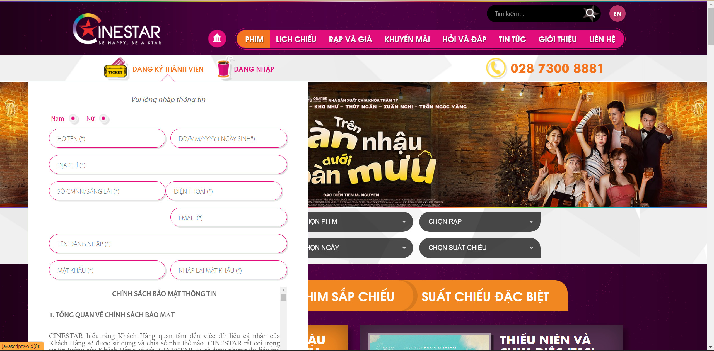
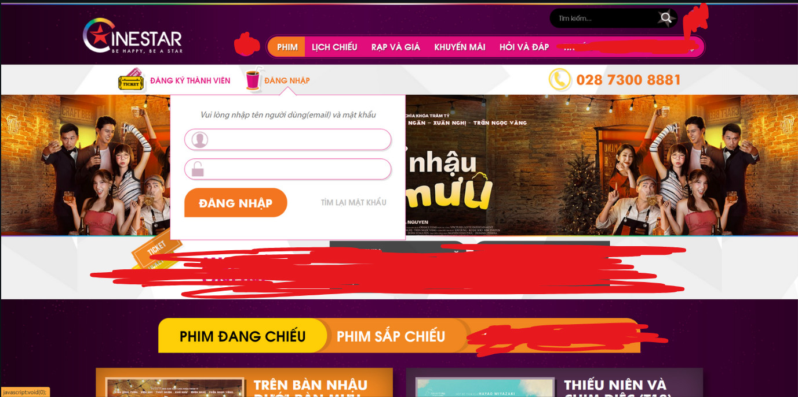
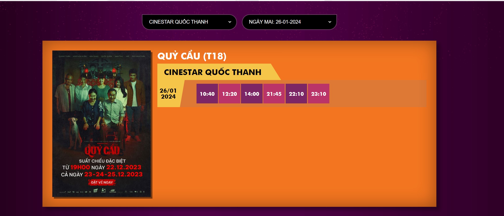
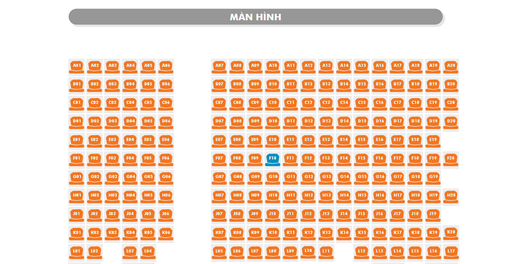
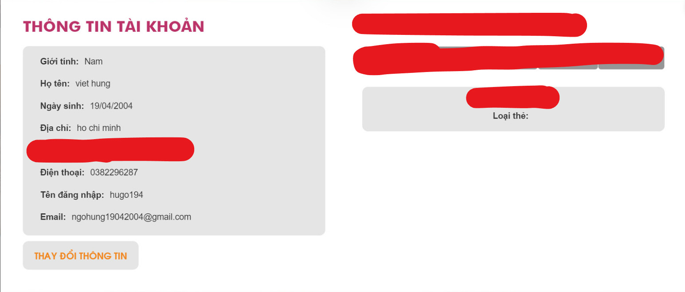
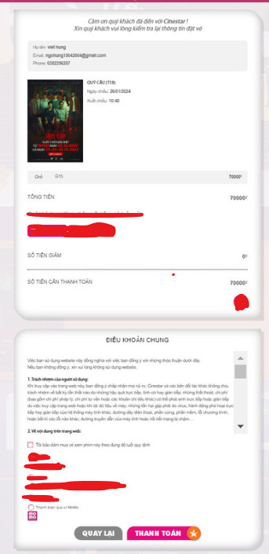
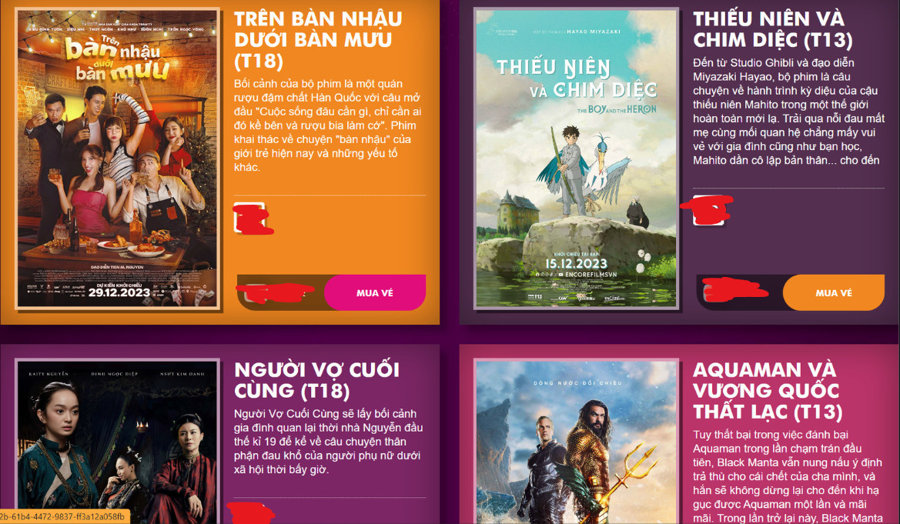
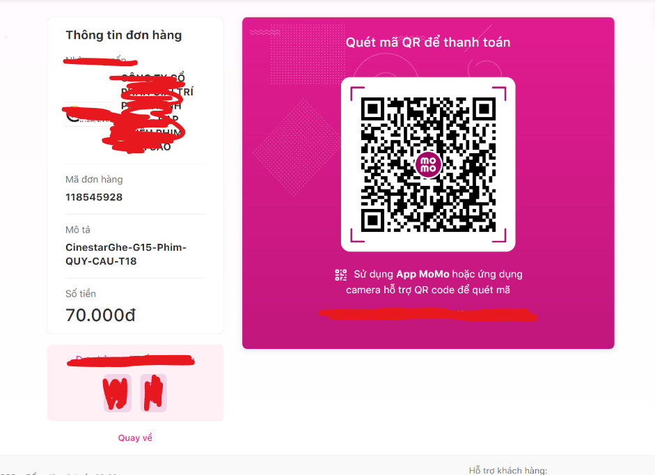
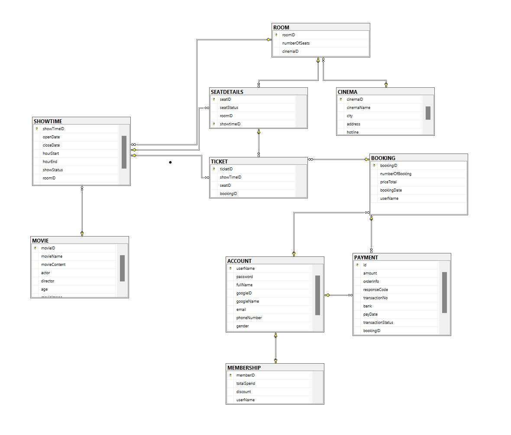
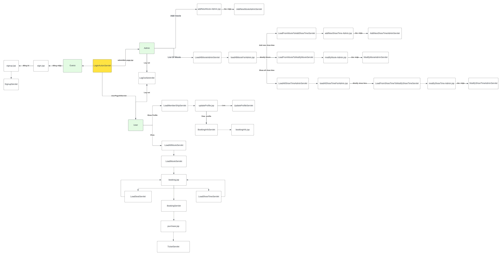

# PRJ301 - SE1860 Assignment
## MEMBER
- SE182470 - Nguyễn Hoàng Phúc
- SE182249 - Dương Minh An
- SE182441 - Ngô Việt Hưng
- SE182454 - Nguyễn Công Thiên Lộc
##  REQUIREMENT
### Name of system: **_BOOKING CINEMA TICKETS ONLINE_**. 
### Purpose of system: 
  - Enabling users to book and purchase tickets **ONLINE**.
  - Allowing users to view detailed information about each movie.
  - Providing a schedule for each movie so that the users can easily select any available showtimes.
### Who will use this system?  
- Everyone who has demands on watching movies at the cinemas.  
### List of features
- **User Management**
  - Registration: Users can create an account by providing necessary details like name, email address, and password.
  - Authentication: Registered users can securely log in to the system using their credentials.
  - Profiles: Allows users to manage their profile information, including personal details and preferences.
- **Ticket Booking**
    - Movie And Showtime Selection: Provides an interactive layout for users to choose their preferred showtime of movie for an event.
    - Seat Selection: Provides an interactive seating layout or seat map for users to choose their preferred seat(s) for an event.
    - Seat Availability: Shows real-time availability of seats, until a specific user purchases any of seats, they wil turn into unavailable status.
- **Payment Method**
    - E-wallet: Engages a VNPAY e-wallet payment after the "Ticket booking" process.
    - Payment Confirmation: Sends notifications to users' accounts after successful payment, providing them with the booking details and a unique reference number.
- **Booking Management**
    - Booking History: Displays users' booking history, including past and upcoming events, ticket details, and payment information.
- **Admin Management**
  - Provides a centralized interface for the admin to access and manage various functionalities of the ticket booking system.
  - Presents an overview of key system metrics, such as total bookings, revenue, and user statistics.
  - Allows the admin to create (add), edit, and delete events in the system.

##  GRAPHICAL USER INTERFACE (GUI)

##  ENTITY RELATIONSHIP DIAGRAM

## SYSTEM DESIGN

## CONCLUSION
- **ALL SKILLS THAT WE GAIN:**
  - Learn how to research documents on the internet such as stackoverflow.
  - Debug skill improved.
  - Learn how to do tasks with team (Teamwork skill).
  - Gain knownledge about other fields such as APIs, Google Library, Email Library, Payment Enviroment.
  - Level up based skill such as Java, HTML, CSS, Javascript, using database.
- **DRAWBACKS:**
  - Not really focusing on designing database that need to be fixed several times during the project.
  - Not really using Git skill during the project.
  - Need back up plans for bad situations.